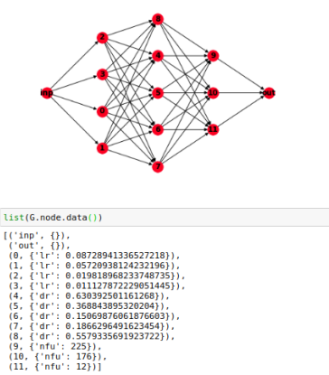

Link to the [lab course](http://campar.in.tum.de/Chair/TeachingSs20MLMI)

# Hyperparameter optimization using ACO

The most popular variation of ACO algorithms, namely [ACS(Ant Colony System)](http://people.idsia.ch/~luca/acs-ec97.pdf) algorithm is considered.

### Problem baseline

A directional graph in a feed forward network fashion is set up. Apart from input and output layer, each layer has specific hyperparameter, 
and nodes in the layer hold different values of that hyperparameter.  
The ant trail starts from input node and passes through different hyperparameter layers, picking up one value at each layer and reaches the output node.

The network shown below has 3 different hyperparameters, namely learning rate, dropout rate and number of fully connected units with 4, 5 and 3 different values respectively.
We can specify how many values can be given to particular layer. 
These values are randomly selected from uniform distribution of given range.

**Note**: In google colab, PyGraphviz package can't be installed and so, the above network is generated locally on virtual environment.

The first group of ants are generated, which start from input node and take path following aco select rule and finally reach output node.
The local update of weight of edges (pheromone value) is performed on the path travelled by ant, allowing other ants not to choose same path.

Thus, each and every ant will have its own path from input to output node. 
As path is completed by the ant, we will have set of hyperparameters received. Python worker takes this set as hyperparameter configuration, and evaluates the validation loss.
The best path is stored, for which minimal loss is obtained on the validation set.

Global pheromone update is performed on all paths traversed by the group. It deposits pheromone on the best path and evaporates on all other paths.
The purpose of Global update is to make the search for hyperparameters more directed towards best path.

then, new group of ants are generated to find other best paths, if they exist and we follow same procedure again.

At the end, we get best paths by the respective group of ants.

We compare the best path losses to get the overall best path, which contains the optimized set of hyperparameters by ACO.

**Assumptions**:
1. Heuristic information is not considered.
2. All initial pheromone values(weight of edges) are chosen as 1.
3. Greediness,decay and evaporation values are chosen as 0.5,0.1 and 0.1 respectively.

### Datasets

Dataset till mid presentation: MNIST and CIFAR

Dataset later: ISIC
